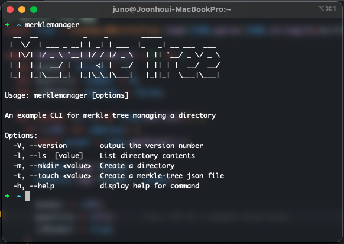
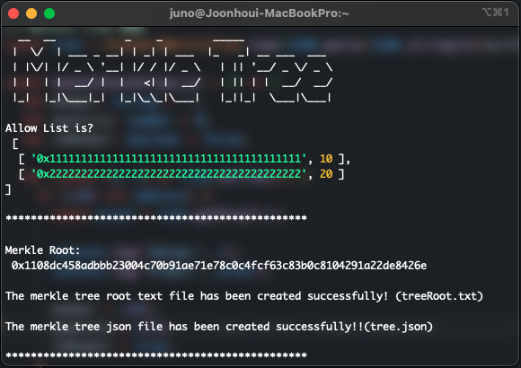

# Merkle-Tree JSON file Maker

### Install packages

```bash
npm install
```

### Build

```bash
npm run build
```

### If you want to global install

```bash
npm install -g
```

### Usage

```bash
merklemanager
```



```bash
merklemanager -t <Your excel file path>
```

then 「tree.json」file and 「treeRoot.txt」 file are created.



### Form & Extension

#### Form

| address    | amount |
| ---------- | :----: |
| 0x11111... |   10   |
| 0x22222... |   20   |
| 0x33333... |   30   |

#### Extension

.xlsx(excel)
